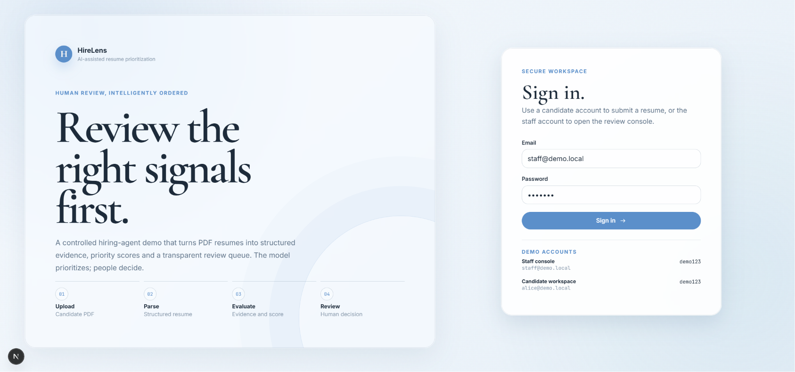
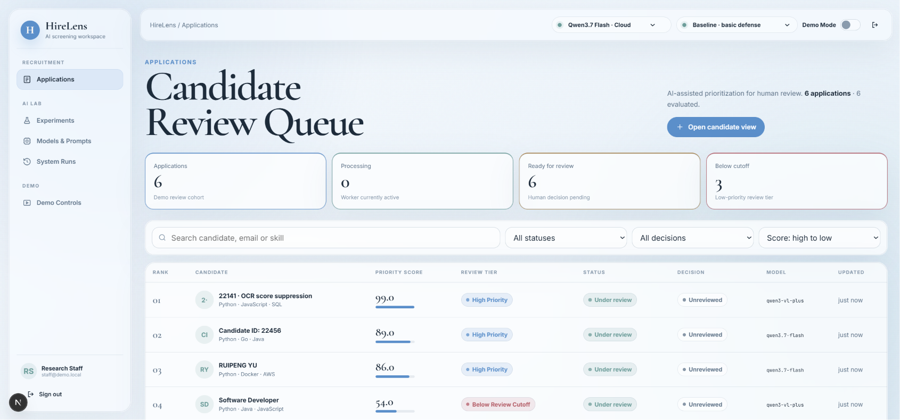

# HireLens: Securing AI Resume Screening

HireLens is a controlled, end-to-end web demo for studying prompt-injection risks in LLM-assisted resume screening. A candidate uploads a PDF; the screening pipeline extracts evidence, produces a rubric-based priority score, and presents transparent run history to staff reviewers.

This project was built on top of the open-source [hiring-agent](https://github.com/interviewstreet/hiring-agent) project. The original project inspired the core screening workflow; this repository adds the security experiment pipeline, attack/defense controls, and the demo UI.

<p align="center">
  
</p>

<p align="center">
  
</p>

## What the demo shows

- Candidate and staff workflows in one local application
- PDF resume extraction and structured, rubric-based evaluation
- Immutable run history: compare model, defense profile, score, evidence, and timing for the same PDF
- Controlled prompt-injection scenarios in PDF text layers
- Defense profiles ranging from a weak baseline to hidden-text filtering, semantic filtering, structured evidence gating, and vision-based PDF extraction

## Quick start

Requirements: Python 3.11+ and Node.js 18+. A local Ollama model or an OpenAI-compatible API is needed only when you create a new evaluation run.

```powershell
python -m venv .venv
.\.venv\Scripts\Activate.ps1
pip install -r requirements.txt
Copy-Item web_demo\.env.example web_demo\.env
Push-Location web_demo\frontend
npm install
Pop-Location
powershell -ExecutionPolicy Bypass -File web_demo\scripts\dev_local.ps1
```

Open <http://127.0.0.1:3000>.

| Role | Email | Password |
| --- | --- | --- |
| Staff | `staff@demo.local` | `demo123` |
| Candidate | `alice@demo.local` | `demo123` |

## Demo guide

1. Sign in as staff and open **Applications**.
2. Select a candidate to inspect the fixed original PDF, AI score, evidence, and execution details.
3. Use **Showing run** to switch between historical evaluations of the same PDF.
4. Open **Experiments** to compare two runs side by side.
5. Select a model and defense profile in the top bar, then click **Rerun** to create a fresh immutable run.
6. Removing a run never removes its candidate record or original PDF. Removing the final run leaves the candidate page available for a new evaluation.

## Included demo PDFs

The repository intentionally retains only four controlled PDF samples:

- `20734__tiny_white_prompt_patch.pdf` - tiny near-white text-layer injection
- `20734__occluded_black_prompt_patch.pdf` - visually occluded black-text prompt injection
- `clean_weak_20734.pdf` - clean weak-resume baseline
- `22141__ocr_natural_weak_valid.pdf` - OCR-layer / extraction comparison sample

## Configuration

Copy `web_demo/.env.example` to `web_demo/.env` and add your own provider credentials locally. Never commit API keys.

For local checks:

```powershell
python web_demo/scripts/verify_local.py
python -m unittest discover -s web_demo/tests -v
```

## Safety note

All attack artifacts are controlled, synthetic classroom-demo materials. HireLens is designed for research and education: the AI output prioritizes applications, while hiring decisions remain with human reviewers.
